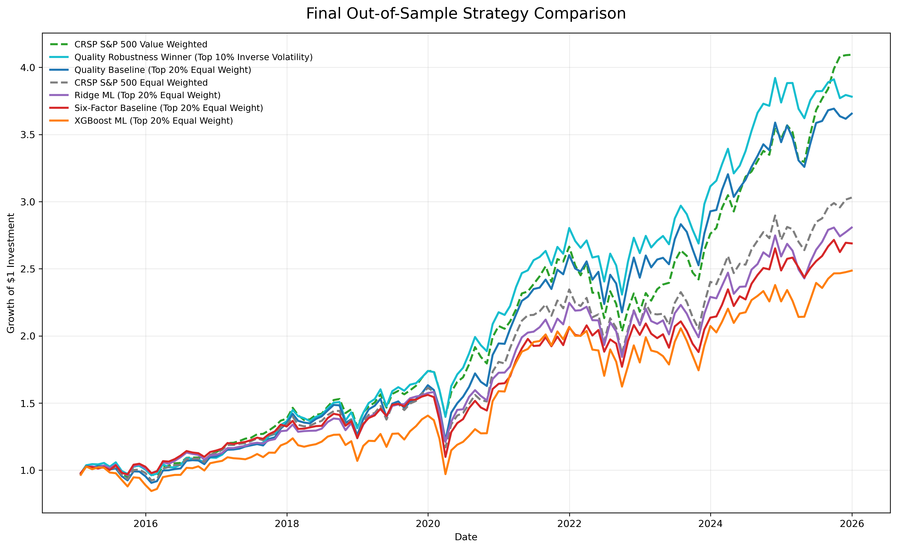
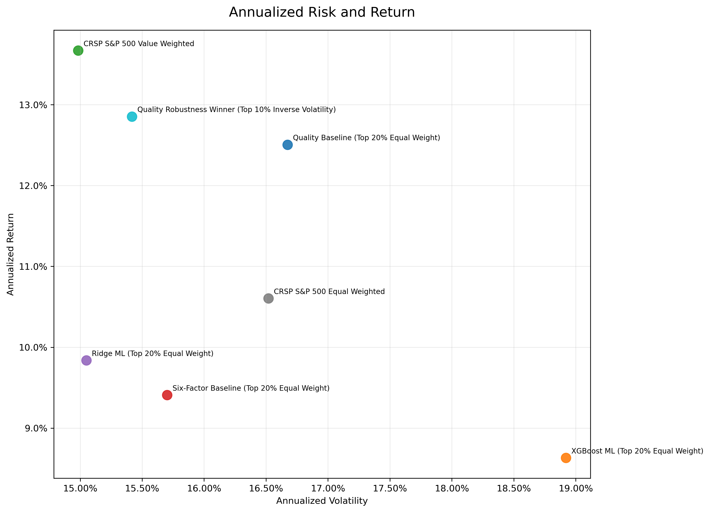
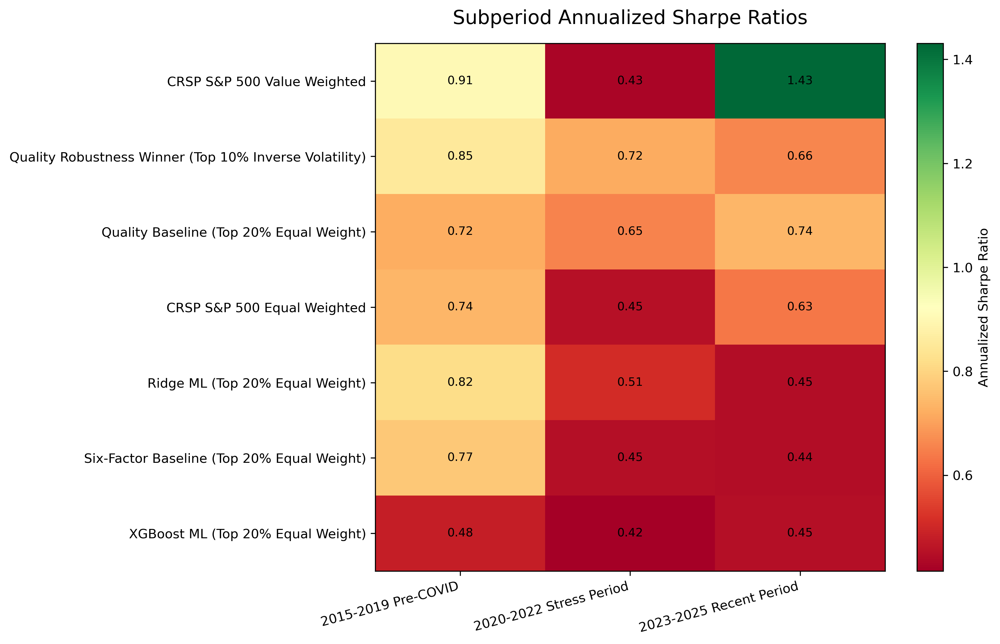
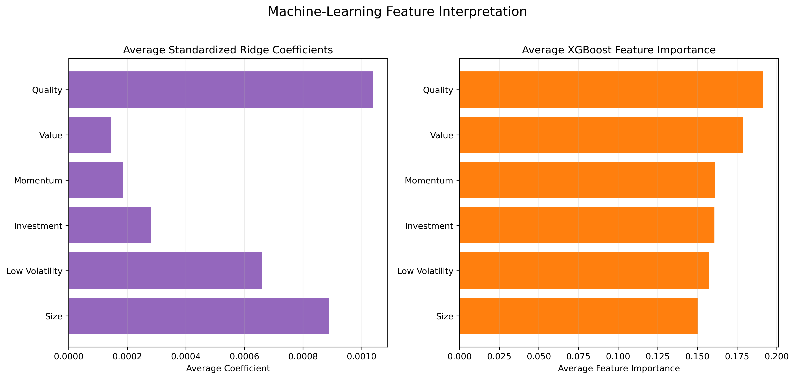
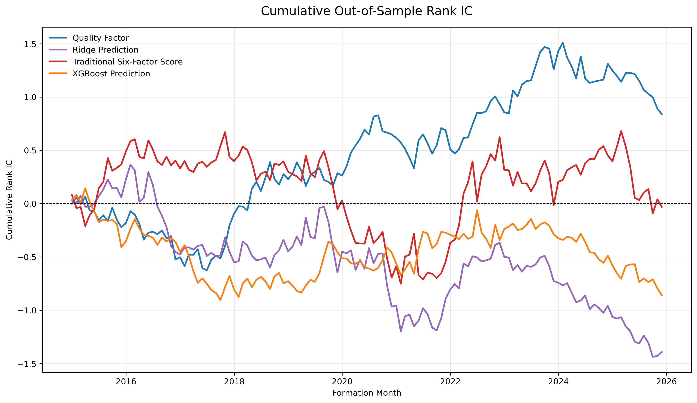
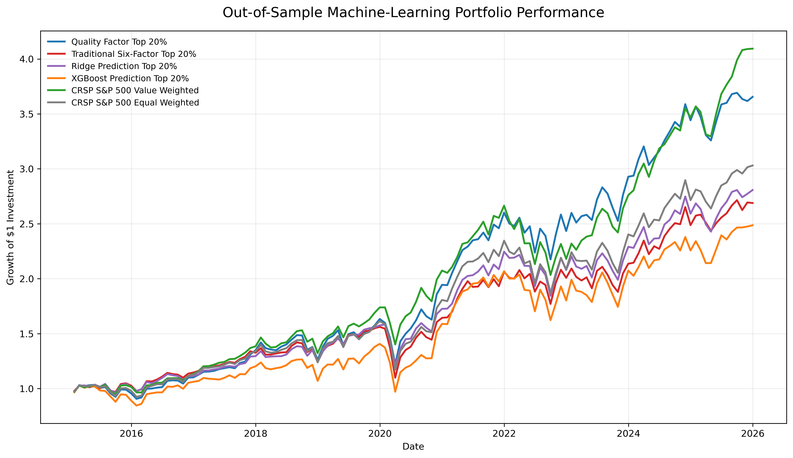
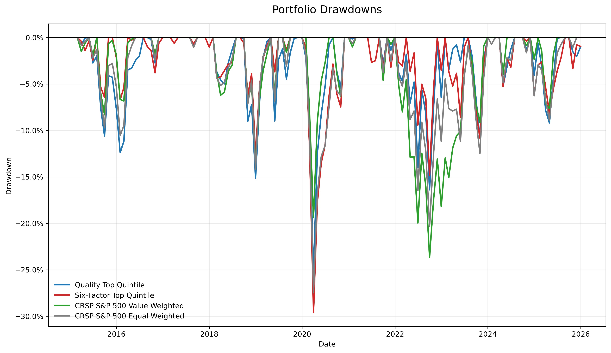
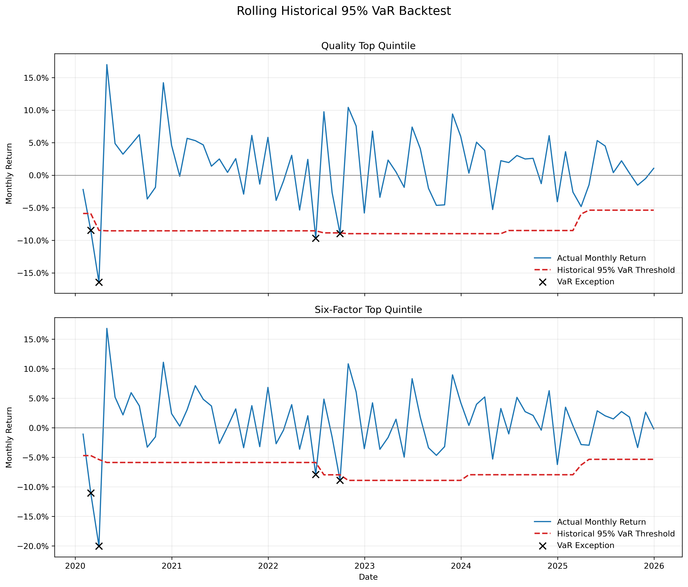

# Multi-Factor Equity Strategy

## Factor Discovery, Portfolio Construction, and Risk-Adjusted Performance Evaluation

This project develops an end-to-end empirical framework for researching systematic equity factors in the historical S&P 500 universe.

The workflow covers:

- Point-in-time data engineering
- Cross-sectional factor construction
- Information-coefficient analysis
- Factor portfolio sorts
- Fama–MacBeth regressions
- Monthly portfolio construction
- Transaction-cost-aware backtesting
- Fama–French factor attribution
- Tail-risk and drawdown analysis
- Robustness and sensitivity testing
- Out-of-sample Ridge and XGBoost comparisons
- Multiple-testing correction

The objective is not simply to identify the strategy with the highest historical return. Instead, the project evaluates whether apparent outperformance survives realistic data treatment, investable benchmark comparison, transaction costs, factor attribution, tail-risk analysis, out-of-sample testing, and multiple-testing correction.

---

## Research Question

> Can a systematic multi-factor equity model generate economically and statistically meaningful risk-adjusted performance relative to investable S&P 500 benchmarks?

The final results indicate that a simple quality strategy produced economically favorable performance relative to the S&P 500 equal-weighted benchmark. However, neither its active return nor its factor-adjusted alpha remained statistically significant after Holm multiple-testing correction.

The more complex six-factor, Ridge, and XGBoost strategies did not improve genuine out-of-sample performance.

---

## Research Design

### Investment Universe

The investment universe consists of historical S&P 500 constituents rather than the current constituent list.

Key design choices include:

- Historical index membership determined separately for each month
- Inclusion of firms that were subsequently removed or delisted
- Monthly portfolio formation
- Monthly portfolio rebalancing
- Factor-research period: 2005–2025
- Out-of-sample portfolio evaluation: 2015–2025
- Approximately 500 securities in each monthly cross-section
- Approximately 139,000 security-month observations in the final panel

Using historical membership reduces the survivorship bias that would arise from applying the current S&P 500 constituent list retrospectively.

### Data Sources

The analysis uses:

1. **CRSP**
   
   - Historical S&P 500 constituents
   - Daily stock prices
   - Daily total returns
   - Trading volume
   - Shares outstanding
   - Market capitalization
   - Official S&P 500 value-weighted and equal-weighted benchmark returns

2. **Compustat North America**
   
   - Annual accounting fundamentals
   - Book equity
   - Earnings
   - Total assets
   - Revenue
   - Profitability
   - Investment
   - Accrual-related variables

3. **CRSP/Compustat Merged Database**
   
   - Historical `GVKEY`–`PERMNO` links
   - Link types
   - Link priority
   - Historical link start and end dates

4. **Kenneth R. French Data Library**
   
   - Market excess return
   - SMB
   - HML
   - RMW
   - CMA
   - Momentum
   - Monthly risk-free rate

CRSP, Compustat, and CCM are licensed databases. Their security-level observations are not distributed in this repository.

---

## Data Engineering

The project builds a point-in-time security-month panel through the following process:

1. Download historical S&P 500 membership and daily CRSP data.
2. Convert daily stock observations into monthly security observations.
3. Compound daily total returns into monthly total returns.
4. Retain month-end prices, capitalization, volume, and security information.
5. Clean Compustat annual accounting records.
6. Resolve duplicate accounting records through reporting-format priorities.
7. Link Compustat `GVKEY` identifiers to CRSP `PERMNO` identifiers.
8. Apply historical CCM link start and end dates.
9. Match accounting information only after its assumed public availability date.
10. Construct one-month-ahead returns for predictive testing.
11. Validate the final panel before factor construction.

### Data-Quality Validation

The monthly CRSP panel contains:

- 138,997 security-month observations
- 1,004 unique `PERMNO` identifiers
- 2003–2025 monthly coverage
- Zero duplicate `PERMNO`–month records
- Approximately 499–506 constituents per month

The CRSP–CCM linking process achieved:

- 99.25% overall matching rate
- No duplicated `PERMNO`–month observations after linking

The point-in-time accounting merge achieved:

- 97.84% overall accounting match rate
- 99.20% accounting match rate during the backtest period
- Zero detected accounting look-ahead violations

---

## Factor Construction

Six economically motivated factors are evaluated.

| Factor         | Principal signals                                | Preferred direction |
| -------------- | ------------------------------------------------ | -------------------:|
| Value          | Book-to-market and earnings-to-price             | Higher              |
| Momentum       | Prior 12-to-1-month price performance            | Higher              |
| Quality        | Profitability, ROE, and accrual-related measures | Higher quality      |
| Investment     | Asset growth                                     | More conservative   |
| Size           | Market capitalization                            | Smaller             |
| Low Volatility | Trailing 12-month return volatility              | Lower               |

Raw signals are processed separately within each monthly cross-section:

1. Invalid and economically implausible values are removed.
2. Extreme observations are winsorized.
3. Signals are converted into cross-sectional z-scores.
4. Factor directions are aligned so that higher scores represent preferred securities.
5. Related signals are combined into factor-level scores.
6. The six standardized factor scores are combined into a composite score.

The factor file also contains the following month’s return, which is used only as an evaluation target and never as a formation-month signal.

---

## Factor Validation

Factor validity is evaluated before portfolio construction.

### Information Coefficient

For each factor and month, the project calculates:

\[
IC_t = \operatorname{Corr}(Factor_{i,t}, Return_{i,t+1})
\]

Both Pearson and Spearman information coefficients are reported.

### Portfolio Sorts

Securities are assigned to monthly factor quintiles.

For each factor, the analysis compares:

- Q1 through Q5 average returns
- Equal-weighted long-short returns
- Value-weighted long-short returns
- Return monotonicity
- Newey–West t-statistics
- Positive-month rates

### Fama–MacBeth Regressions

Monthly cross-sectional regressions estimate the relationship between standardized factor scores and future returns:

\[
R_{i,t+1}
=
\alpha_t
+
\sum_{k=1}^{K}
\lambda_{k,t}F_{i,k,t}
+
\varepsilon_{i,t+1}
\]

The time-series means of the monthly coefficients are evaluated using Newey–West standard errors.

Regressions are estimated using:

- Raw future returns
- Winsorized future returns
- Full-sample data
- 2005–2014 and 2015–2025 subperiods

### Factor Correlations

Average monthly Spearman correlations are used to identify overlapping factor signals. This helps determine whether the composite model contains genuinely distinct information or repeatedly measures similar firm characteristics.

---

## Main Factor-Testing Findings

Quality was the most consistent individual factor.

### Quality Quintile Results

Average equal-weighted monthly returns increased monotonically across all five quality quintiles:

| Quintile    | Average monthly return |
| ----------- | ----------------------:|
| Q1          | 0.777%                 |
| Q2          | 0.893%                 |
| Q3          | 0.927%                 |
| Q4          | 0.985%                 |
| Q5          | 1.071%                 |
| Q5 minus Q1 | 0.294%                 |

The quality long-short results were:

| Weighting method | Annualized return | Newey–West p-value |
| ---------------- | -----------------:| ------------------:|
| Equal Weight     | 3.52%             | 0.076              |
| Value Weight     | 6.22%             | 0.032              |

In the multivariate Fama–MacBeth regression using winsorized future returns, quality produced:

- Annualized coefficient: approximately 0.79%
- Newey–West t-statistic: approximately 1.97
- p-value: approximately 0.049

However, the quality premium was not equally strong in every subperiod. Its Fama–MacBeth coefficient was stronger during 2005–2014 and substantially weaker during 2015–2025.

### Other Factors

Value, momentum, investment, size, and low volatility showed weaker or less stable full-sample evidence.

The six-factor composite did not consistently improve on the strongest individual quality signal.

---

## Portfolio Strategies

The pre-specified portfolio strategies are:

1. Quality Top Quintile, Equal Weight
2. Six-Factor Top Quintile, Equal Weight
3. Historical S&P 500 Universe, Equal Weight
4. Historical S&P 500 Universe, Value Weight

The robustness analysis additionally evaluates:

- Top 10%, 20%, and 30% selections
- Equal weighting
- Inverse-volatility weighting
- Score-rank weighting
- Transaction costs of 0, 10, 25, and 50 basis points

### Portfolio Timing

At each formation month:

1. Factor scores are calculated using information available at that time.
2. Securities are ranked cross-sectionally.
3. Target portfolio weights are formed.
4. The portfolio is held for the following month.
5. The next month’s realized security returns are applied.
6. Transaction costs are deducted according to portfolio turnover.

The principal backtests apply a 10-basis-point proportional transaction cost.

---

## Main Out-of-Sample Results

The final portfolio evaluation covers January 2015 through December 2025, for a total of 132 out-of-sample months.

| Strategy                           | Annual return | Volatility | Sharpe | Maximum drawdown | Average turnover |
| ---------------------------------- | -------------:| ----------:| ------:| ----------------:| ----------------:|
| CRSP S&P 500 Value Weighted        | 13.67%        | 14.98%     | 0.808  | -23.67%          | N/A              |
| Quality Top 10% Inverse Volatility | 12.85%        | 15.42%     | 0.740  | -19.65%          | 7.85%            |
| Quality Top 20% Equal Weight       | 12.51%        | 16.67%     | 0.678  | -25.20%          | 7.57%            |
| CRSP S&P 500 Equal Weighted        | 10.60%        | 16.52%     | 0.580  | -27.47%          | N/A              |
| Ridge Prediction Top 20%           | 9.84%         | 15.05%     | 0.574  | -23.46%          | 12.59%           |
| Six-Factor Top 20%                 | 9.41%         | 15.70%     | 0.532  | -29.60%          | 19.55%           |
| XGBoost Prediction Top 20%         | 8.63%         | 18.92%     | 0.432  | -30.98%          | 29.90%           |

The Quality Top 20% Equal-Weight strategy is the **pre-specified primary factor strategy**.

The Quality Top 10% Inverse-Volatility strategy is reported as an **ex-post sensitivity winner** and is not treated as independently validated model selection.

The full aggregated performance results are available in:

- [Final performance summary](reports/tables/final_performance_summary.csv)
- [Subperiod performance summary](reports/tables/subperiod_performance_summary.csv)

### Final Cumulative Performance



### Annualized Risk and Return



### Subperiod Sharpe Ratios



---

## Active Performance

The Quality Top 20% Equal-Weight strategy produced the following performance relative to the CRSP S&P 500 equal-weighted benchmark:

- Annualized active return: 1.73%
- Annualized tracking error: 3.28%
- Information ratio: 0.528
- Positive active-month rate: 53.79%
- Raw HAC active-return p-value: 0.083
- Holm-adjusted active-return p-value: 0.414

The Quality Top 10% Inverse-Volatility sensitivity winner produced:

- Annualized active return: 1.84%
- Annualized tracking error: 4.87%
- Information ratio: 0.377
- Holm-adjusted active-return p-value: 0.786

Neither strategy produced a statistically significant active return after Holm correction.

The complete results are available in:

- [Active-return tests](reports/tables/active_return_tests.csv)

---

## Factor Attribution

Portfolio returns are evaluated using:

1. CAPM
2. Fama–French five-factor model
3. Fama–French five-factor model plus momentum

The principal attribution model is:

\[
R_{p,t}-R_{f,t}
=
\alpha
+
\beta_{MKT}(MKT_t-RF_t)
+
\beta_{SMB}SMB_t
+
\beta_{HML}HML_t
+
\beta_{RMW}RMW_t
+
\beta_{CMA}CMA_t
+
\beta_{MOM}MOM_t
+
\varepsilon_t
\]

Newey–West standard errors are used for statistical inference.

### Quality Baseline

The Quality Top 20% Equal-Weight strategy produced:

- Annualized factor-adjusted alpha: -0.53%
- Alpha t-statistic: -0.46
- Raw alpha p-value: 0.645
- Holm-adjusted alpha p-value: 1.000

### Quality Sensitivity Winner

The Quality Top 10% Inverse-Volatility strategy produced:

- Annualized factor-adjusted alpha: -0.57%
- Alpha t-statistic: -0.41
- Raw alpha p-value: 0.682
- Holm-adjusted alpha p-value: 1.000

### Interpretation

The quality strategies delivered economically favorable historical performance relative to the equal-weighted benchmark, but the performance cannot be interpreted as statistically reliable independent alpha.

The complete results are available in:

- [Factor-alpha tests](reports/tables/factor_alpha_tests.csv)
- [Final strategy evidence table](reports/tables/strategy_evidence_table.csv)

---

## Machine-Learning Comparison

Two machine-learning models are compared with the traditional factor models:

- Ridge regression
- XGBoost regression

### Walk-Forward Design

The machine-learning analysis uses an annual expanding-window design.

For prediction year \(Y\):

1. Training formation months end in November of year \(Y-1\).
2. Model parameters are estimated using only earlier observations.
3. Predictions are generated from December \(Y-1\) through November \(Y\).
4. These predictions correspond to realized returns from January through December of year \(Y\).
5. No future observations are included in model estimation.

This produces a genuine out-of-sample prediction period from 2015 through 2025.

### Feature Interpretation

Quality had:

- The largest average standardized Ridge coefficient
- The largest average XGBoost feature importance
- A positive coefficient in every annual Ridge estimation window

However, feature importance does not imply reliable predictive performance.



### Out-of-Sample Prediction IC

The average out-of-sample Spearman ICs were approximately:

| Signal                       | Mean rank IC |
| ---------------------------- | ------------:|
| Quality factor               | 0.0064       |
| Traditional six-factor score | -0.0002      |
| Ridge prediction             | -0.0105      |
| XGBoost prediction           | -0.0065      |

None of the prediction signals produced a statistically significant positive mean rank IC.



### Machine-Learning Portfolio Performance

Ridge and XGBoost both underperformed the simple quality strategy.

XGBoost produced:

- The lowest annualized return
- The highest volatility
- The lowest Sharpe ratio
- The largest maximum drawdown
- The highest portfolio turnover

Its raw negative factor-adjusted alpha was statistically significant at the 5% level, but it was no longer significant after Holm correction:

- Annualized alpha: -3.36%
- Raw alpha p-value: 0.016
- Holm-adjusted p-value: 0.078



### Interpretation

The machine-learning results demonstrate that greater model complexity did not improve return prediction in this setting.

Potential explanations include:

- Low signal-to-noise ratios in monthly stock returns
- Relatively small cross-sectional sample size
- Factor instability across market regimes
- Higher portfolio turnover
- Non-stationary relationships between firm characteristics and future returns
- Limited incremental information beyond the traditional factor scores

---

## Robustness Analysis

The robustness analysis evaluates 18 portfolio specifications based on:

- Two signals
- Three selection thresholds
- Three weighting methods

Each strategy is evaluated under four transaction-cost assumptions.

### Quality Robustness

Under a 10-basis-point transaction cost, the strongest quality specification was:

**Quality Top 10% Inverse Volatility**

Its results were:

- Annualized return: 12.85%
- Annualized volatility: 15.42%
- Annualized Sharpe ratio: 0.740
- Maximum drawdown: -19.65%
- Historical 95% CVaR: 8.78%
- Average monthly turnover: 7.85%

This specification is explicitly labeled an ex-post sensitivity winner.

### Six-Factor Robustness

The six-factor strategies generally improved as the portfolio became broader:

- Top 10% portfolios generated the highest turnover.
- Top 30% portfolios generally produced better Sharpe ratios.
- Inverse-volatility weighting modestly reduced risk.
- No six-factor specification outperformed the quality strategies.
- Several six-factor specifications produced significantly negative raw alphas.

### Transaction-Cost Sensitivity

Quality strategies were relatively insensitive to transaction-cost changes because of their lower turnover.

Six-factor strategies were more sensitive because their rankings changed more frequently.

For example, increasing costs from 0 to 50 basis points reduced the annualized return of the Six-Factor Top 10% Equal-Weight strategy by approximately 1.49 percentage points.

---

## Risk Analysis

Risk evaluation includes:

- Annualized volatility
- Downside deviation
- Sharpe ratio
- Sortino ratio
- Maximum drawdown
- Calmar ratio
- Historical VaR
- Historical CVaR
- Skewness
- Excess kurtosis
- Drawdown duration
- Recovery duration
- Stress-period performance
- Rolling 36-month volatility
- Rolling 36-month downside deviation
- Rolling 36-month Sharpe ratio
- Rolling historical VaR forecasts
- Kupiec unconditional-coverage tests
- Christoffersen independence tests
- Christoffersen conditional-coverage tests

### Portfolio Drawdowns



### Maximum-Drawdown Episodes

| Series              | Maximum drawdown | Peak    | Trough  | Recovery |
| ------------------- | ----------------:| ------- | ------- | -------- |
| Quality Top 20%     | -25.20%          | 2019-12 | 2020-03 | 2020-08  |
| Six-Factor Top 20%  | -29.60%          | 2019-12 | 2020-03 | 2020-11  |
| CRSP Value Weighted | -23.67%          | 2021-12 | 2022-09 | 2023-12  |
| CRSP Equal Weighted | -27.47%          | 2019-12 | 2020-03 | 2020-11  |

### Historical VaR Backtest

The rolling historical VaR backtest uses:

- 60-month estimation windows
- 95% confidence level
- 72 out-of-sample forecasts per series

Each evaluated series recorded:

- Expected exceptions: 3.6
- Observed exceptions: 4
- Exception rate: 5.56%
- Kupiec p-value: 0.832
- Christoffersen independence p-value: 0.182
- Conditional-coverage p-value: 0.401

The null hypotheses of correct unconditional and conditional coverage were not rejected.



### CVaR Interpretation

Although the VaR exception rates were statistically acceptable, average realized losses during exceptions were moderately larger than the corresponding CVaR forecasts.

Therefore, the historical risk model estimated exception frequency more successfully than extreme tail-loss severity.

---

## Stress Testing

The project separately evaluates:

- 2015–2016 market selloff
- Fourth-quarter 2018 selloff
- 2020 COVID-19 crash
- 2022 market drawdown

### 2020 COVID-19 Crash

Cumulative returns during the designated crash period were approximately:

| Series              | Cumulative return |
| ------------------- | -----------------:|
| CRSP Value Weighted | -19.39%           |
| Quality Top 20%     | -23.52%           |
| CRSP Equal Weighted | -26.17%           |
| Six-Factor Top 20%  | -28.84%           |

### 2022 Market Drawdown

During the designated 2022 stress period:

| Series              | Cumulative return |
| ------------------- | -----------------:|
| Six-Factor Top 20%  | -4.91%            |
| Quality Top 20%     | -7.68%            |
| CRSP Equal Weighted | -12.65%           |
| CRSP Value Weighted | -17.55%           |

No strategy dominated in every market regime.

---

## Subperiod Analysis

The out-of-sample evaluation is divided into:

1. 2015–2019 pre-COVID period
2. 2020–2022 stress period
3. 2023–2025 recent period

### Annualized Returns

| Series                             | 2015–2019 | 2020–2022 | 2023–2025 |
| ---------------------------------- | ---------:| ---------:| ---------:|
| CRSP Value Weighted                | 11.69%    | 7.84%     | 23.38%    |
| Quality Top 10% Inverse Volatility | 11.70%    | 14.60%    | 13.06%    |
| Quality Top 20% Equal Weight       | 10.30%    | 14.23%    | 14.52%    |
| CRSP Equal Weighted                | 10.04%    | 8.90%     | 13.30%    |
| Ridge ML                           | 9.50%     | 9.71%     | 10.52%    |
| Six-Factor Top 20%                 | 9.32%     | 8.75%     | 10.23%    |
| XGBoost ML                         | 7.06%     | 8.61%     | 11.32%    |

The results show substantial variation across market regimes. In particular, the value-weighted benchmark was exceptionally strong during 2023–2025.

---

## Multiple-Testing Control

The project evaluates several related strategy specifications. Interpreting the smallest unadjusted p-value would increase the probability of false discoveries.

Holm step-down correction is therefore applied to:

- Active-return tests
- Factor-adjusted alpha tests

After correction:

- No strategy produced statistically significant positive active return.
- No strategy produced statistically significant positive factor-adjusted alpha.
- XGBoost’s negative raw alpha was no longer significant at the 5% family-wise level.

This distinction between economic performance and statistical evidence is central to the final interpretation.

---

## Final Conclusions

1. **Quality was the most robust individual factor.**  
   It produced monotonic quintile returns and the strongest factor-testing evidence.

2. **The pre-specified quality portfolio outperformed the equal-weighted benchmark economically.**  
   It generated a higher annual return, higher Sharpe ratio, and smaller maximum drawdown.

3. **The value-weighted benchmark remained the strongest overall portfolio.**  
   It delivered the highest annual return and Sharpe ratio during the out-of-sample period.

4. **The six-factor composite diluted the stronger quality signal.**  
   Combining weak or unstable factors did not improve performance.

5. **Machine learning did not improve genuine out-of-sample prediction.**  
   Ridge and XGBoost produced negative average rank ICs and weaker portfolio performance.

6. **Additional complexity increased turnover.**  
   XGBoost and concentrated six-factor strategies incurred the highest implementation costs.

7. **Risk-model exception frequencies were acceptable.**  
   Kupiec and Christoffersen tests did not reject the historical VaR forecasts.

8. **Extreme tail severity remained difficult to estimate.**  
   Realized exception losses were moderately larger than predicted CVaR.

9. **Economic outperformance did not equal statistically significant alpha.**  
   No candidate strategy produced significant positive active return or factor-adjusted alpha after Holm correction.

10. **Data discipline materially affected the conclusions.**  
    Historical membership, point-in-time accounting data, transaction costs, benchmark selection, and multiple-testing correction prevented overstated claims.

---

## Project Structure

```text
Multi-Factor-Investment-Strategy
├── data
│   ├── raw
│   ├── interim
│   ├── processed
│   └── README.md
├── notebooks
│   ├── 01_data_processing.ipynb
│   ├── 02_factor_construction.ipynb
│   ├── 03_factor_testing.ipynb
│   ├── 04_portfolio_backtest.ipynb
│   ├── 05_risk_analysis.ipynb
│   ├── 06_robustness_analysis.ipynb
│   ├── 07_machine_learning.ipynb
│   └── 08_final_model_comparison.ipynb
├── reports
│   ├── figures
│   ├── tables
│   └── README.md
├── src
│   ├── __init__.py
│   ├── config.py
│   ├── data.py
│   ├── evaluation.py
│   ├── factors.py
│   ├── ml.py
│   ├── portfolio.py
│   └── risk.py
├── tests
│   └── test_core.py
├── .gitignore
├── requirements.txt
└── README.md
```

---

## Notebook Workflow

| Notebook                          | Purpose                                                                |
| --------------------------------- | ---------------------------------------------------------------------- |
| `01_data_processing.ipynb`        | CRSP, Compustat, and CCM cleaning and point-in-time merging            |
| `02_factor_construction.ipynb`    | Raw-signal construction, winsorization, and factor scoring             |
| `03_factor_testing.ipynb`         | IC, portfolio sorts, factor correlations, and Fama–MacBeth regressions |
| `04_portfolio_backtest.ipynb`     | Portfolio formation, benchmark comparison, and transaction costs       |
| `05_risk_analysis.ipynb`          | Factor attribution, tail risk, stress testing, and VaR validation      |
| `06_robustness_analysis.ipynb`    | Selection, weighting, and transaction-cost sensitivity                 |
| `07_machine_learning.ipynb`       | Annual walk-forward Ridge and XGBoost comparison                       |
| `08_final_model_comparison.ipynb` | Unified out-of-sample evidence and final conclusions                   |

---

## Source-Code Modules

| Module              | Purpose                                                                       |
| ------------------- | ----------------------------------------------------------------------------- |
| `src/data.py`       | Data loading, date conversion, compounding, merging, and validation           |
| `src/factors.py`    | Winsorization, z-scoring, factor combination, and quantile assignment         |
| `src/portfolio.py`  | Security selection, portfolio weights, turnover, and monthly backtests        |
| `src/evaluation.py` | Performance statistics, IC, HAC tests, factor regression, and Holm correction |
| `src/risk.py`       | VaR, CVaR, drawdowns, stress testing, and coverage tests                      |
| `src/ml.py`         | Ridge, XGBoost, and annual walk-forward prediction                            |

---

## Installation

Python 3.8 or later is recommended.

Install the required packages from the project root:

```bash
python -m pip install -r requirements.txt
```

Run the unit tests:

```bash
python -m pytest tests -v
```

The current test suite contains 13 checks covering:

- Data processing
- Date conversion
- Return compounding
- Unique-key validation
- Factor z-scores
- Composite factor scores
- Quantile assignment
- Portfolio weights
- Turnover
- Performance statistics
- Multiple-testing correction
- Historical VaR and CVaR
- Ridge regression

Expected result:

```text
13 passed
```

---

## Reproduction

The security-level input data cannot be included because of CRSP, Compustat, and CCM licensing restrictions.

Researchers with valid WRDS access should:

1. Download the required source datasets.
2. Place original files in `data/raw/`.
3. Execute the notebooks in numerical order.
4. Store intermediate datasets in `data/interim/`.
5. Store final analysis-ready datasets in `data/processed/`.
6. Run the unit tests before interpreting the final results.

Exact results may differ across WRDS data vintages because historical databases may be updated after the original download date.

---

## Data Availability

The repository does not distribute:

- CRSP security-level observations
- Compustat company-level fundamentals
- CCM historical link observations
- Monthly CRSP benchmark return observations
- Individual stock return panels
- Individual factor scores
- `PERMNO`, `GVKEY`, or `CUSIP` research extracts

The repository contains only:

- Source code
- Research notebooks
- Documentation
- Aggregated performance tables
- Aggregated statistical results
- Original research figures

---

## Limitations

- The investment universe is restricted to historical S&P 500 constituents.
- The project does not represent a live investment fund.
- Transaction costs are modeled as proportional to turnover.
- Bid–ask spread variation and nonlinear market impact are not modeled.
- Accounting-data availability relies on conservative reporting-timing assumptions.
- Machine-learning hyperparameter searches are intentionally limited.
- The ex-post robustness winner is not independently validated.
- Historical performance may not persist in future periods.
- Statistical non-rejection does not prove that a risk model is correct.
- The sample contains only 132 final out-of-sample months.
- Results may depend on benchmark selection and market regime.

---

## Research Integrity

The project distinguishes among:

- Pre-specified strategies
- Ex-post sensitivity winners
- Economic outperformance
- Statistical significance
- Raw p-values
- Multiple-testing-adjusted p-values
- In-sample factor evidence
- Genuine out-of-sample performance

The final interpretation does not claim persistent alpha when the statistical evidence does not support such a conclusion.

---

## License and Data Restrictions

CRSP, Compustat, and CCM data remain the property of their respective providers and are not redistributed in this repository.

The source code, documentation, aggregated research results, and original figures are provided for educational and research purposes.

Nothing in this repository constitutes investment advice.
